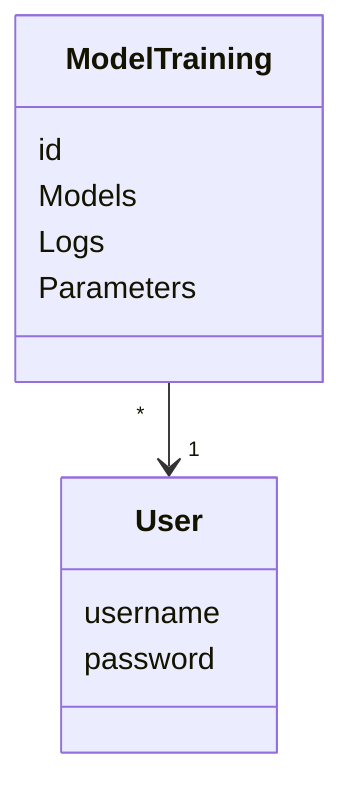

# Architechture

## UI

Currently login screen
Main GUI with button functionality and animations

## Application logic

## Data saving
Username and password are saved into an encrypted table in a SQLite-database.
Training results and parameters are also saved encrypted to the same database in another table.
