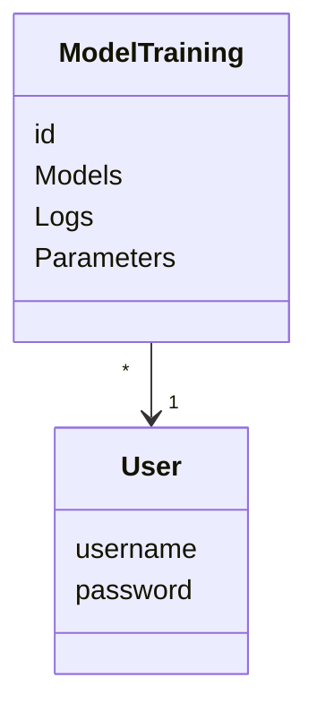

```mermaid
 classDiagram
      ModelTraining "*" --> "1" User
      class User{
          username
          password
      }
      class ModelTraining{
          id
          Models
          Logs
          Parameters
      }
```