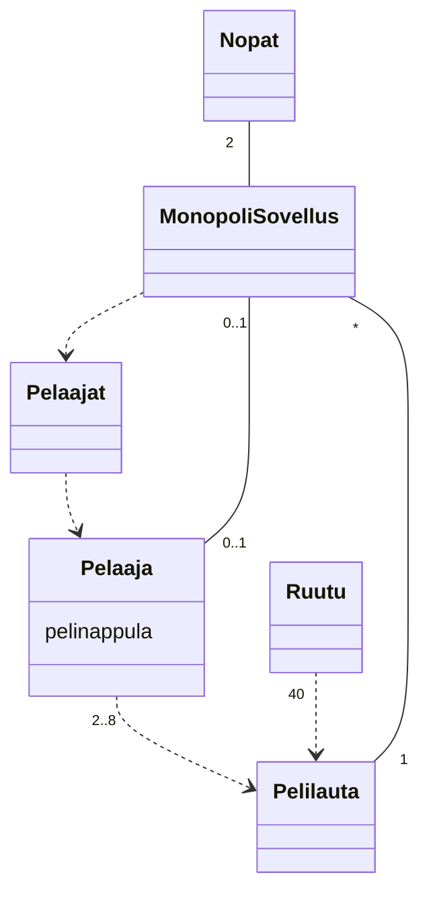
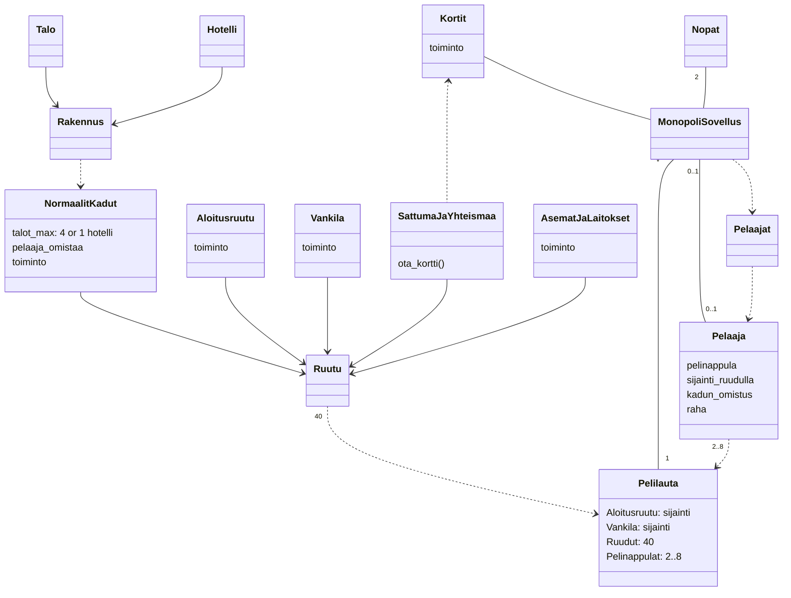
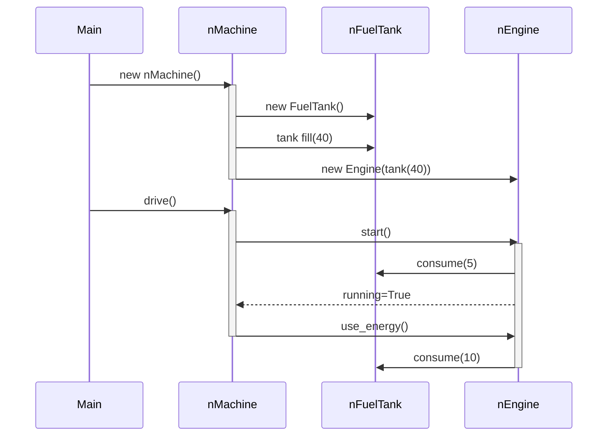

## Tehtava 1: Monopoli


## Tehtava 2: Laajennettu Monopoli



## Tehtava 3: Sekvenssikaavio



## Tehtava 4: Laajempi sekvenssikaavio


```mermaid
sequenceDiagram
    activate main
      main ->> laitehallinto: new HKLLaitehallinto
      main ->> rautatietori: new Lataajalaite
      main ->> ratikka6: new Lukijalaite
      main ->> bussi244: new Lukijalaite
      main ->> laitehallinto: lisaa_lataaja(rautatietori)
      main ->> laitehallinto: lisaa_lukija(ratikka6)
      main ->> laitehallinto: lisaa_lukija(bussi244)
      main ->> lippu_luukku: new Kioski
      main ->> lippu_luukku: osta_matkakortti("Kalle")
      activate lippu_luukku
        lippu_luukku ->> kallen_kortti: new Matkakortti("Kalle", 0, 0, 0)
        lippu_luukku -->> main: kallen_kortti
      deactivate lippu_luukku
      main ->> rautatietori: lataa_arvoa(kallen_kortti, 3)

      activate rautatietori
        rautatietori ->> kallen_kortti: kasvata_arvoa(3)
      deactivate rautatietori

      main ->> ratikka6: osta_lippu(kallen_kortti, 0)

      activate ratikka6
        ratikka6 ->> kallen_kortti: vahenna_arvoa(1.5)
        ratikka6 -->> main: True
      deactivate ratikka6

      main ->> bussi244: osta_lippu(kallen_kortti, 2)

      activate bussi244
        bussi244 -->> main: False
      deactivate bussi244

    deactivate main
  ```