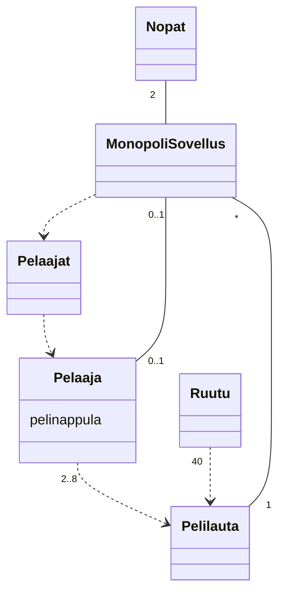
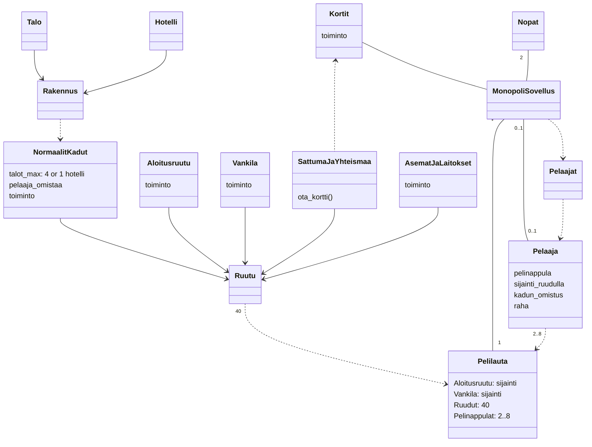
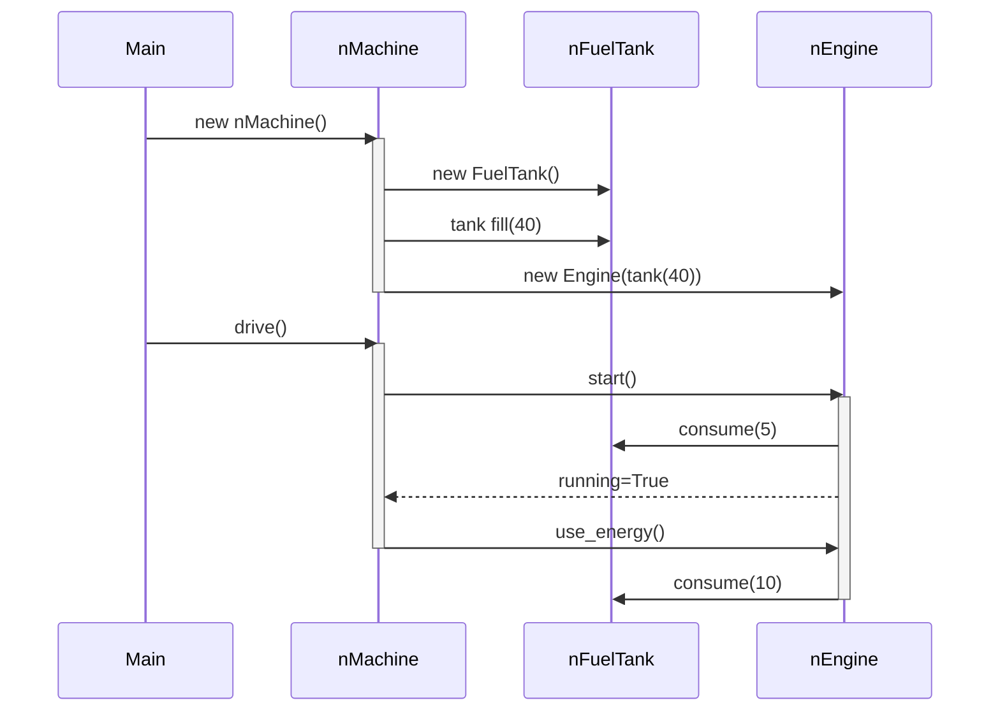

## Tehtava 1: Monopoli

```mermaid
 classDiagram
  class MonopoliSovellus{
  }
  class Nopat{
  }
  class Pelaaja{
    pelinappula
  }
  class Pelaajat{
  }
  Pelaajat ..> Pelaaja
  MonopoliSovellus ..> Pelaajat
  class Pelilauta{
    
  }
  class Ruutu{
  }
  Pelaaja  "0..1" -- "0..1" MonopoliSovellus
  Pelaaja  "2..8" ..>  Pelilauta
  Pelilauta "1" -- "*" MonopoliSovellus
  Nopat "2" -- MonopoliSovellus
  Ruutu "40" ..>   Pelilauta

```
## Tehtava 2: Laajennettu Monopoli

```mermaid
classDiagram
  class MonopoliSovellus{
  }
  class Nopat{
  }
  class Pelaaja{
    pelinappula
    sijainti_ruudulla
    kadun_omistus
    raha
  }
  class Pelaajat{
  }
  class Pelilauta{
    Aloitusruutu: sijainti
    Vankila: sijainti
    Ruudut: 40
    Pelinappulat: 2..8
  }
  class Ruutu{
  }
  class Aloitusruutu{
    toiminto
  }
  class Vankila{
    toiminto
  }
  class SattumaJaYhteismaa{
    ota_kortti()
  }
  class AsematJaLaitokset{
    toiminto
  }
  class NormaalitKadut{
    talot_max: 4 or 1 hotelli
    pelaaja_omistaa
    toiminto
  }
  class Talo{
  }
  class Hotelli{
  }
  class Rakennus{
  }
  class Kortit{
    toiminto
  }

  Pelilauta "1" -- "*" MonopoliSovellus
  Nopat "2" -- MonopoliSovellus
  Pelaaja "0..1" -- "0..1"MonopoliSovellus
  MonopoliSovellus ..> Pelaajat
  Kortit -- MonopoliSovellus

  Hotelli --> Rakennus
  Talo --> Rakennus
  Rakennus ..> NormaalitKadut

  Aloitusruutu --> Ruutu
  Vankila --> Ruutu
  SattumaJaYhteismaa --> Ruutu
  AsematJaLaitokset --> Ruutu
  NormaalitKadut --> Ruutu

  Pelaajat ..> Pelaaja
  Pelaaja "2..8" ..> Pelilauta

  Kortit <.. SattumaJaYhteismaa

  Ruutu "40" ..> Pelilauta
  

```

## Tehtava 3: Sekvenssikaavio

```mermaid
sequenceDiagram
    Main ->> nMachine: new nMachine()
    activate nMachine
    nMachine ->> nFuelTank: new FuelTank()
    nMachine ->> nFuelTank: tank fill(40)
    nMachine ->> nEngine: new Engine(tank(40))
    deactivate nMachine
    Main ->> nMachine: drive()
    activate nMachine
    nMachine ->> nEngine: start()
    activate nEngine
    nEngine ->> nFuelTank: consume(5)
    nEngine -->> nMachine: running=True
    nMachine ->> nEngine: use_energy()
    deactivate nMachine
    nEngine ->> nFuelTank: consume(10)
    deactivate nEngine
```